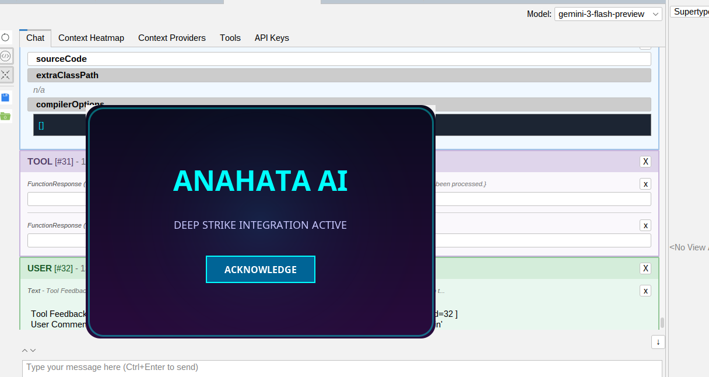
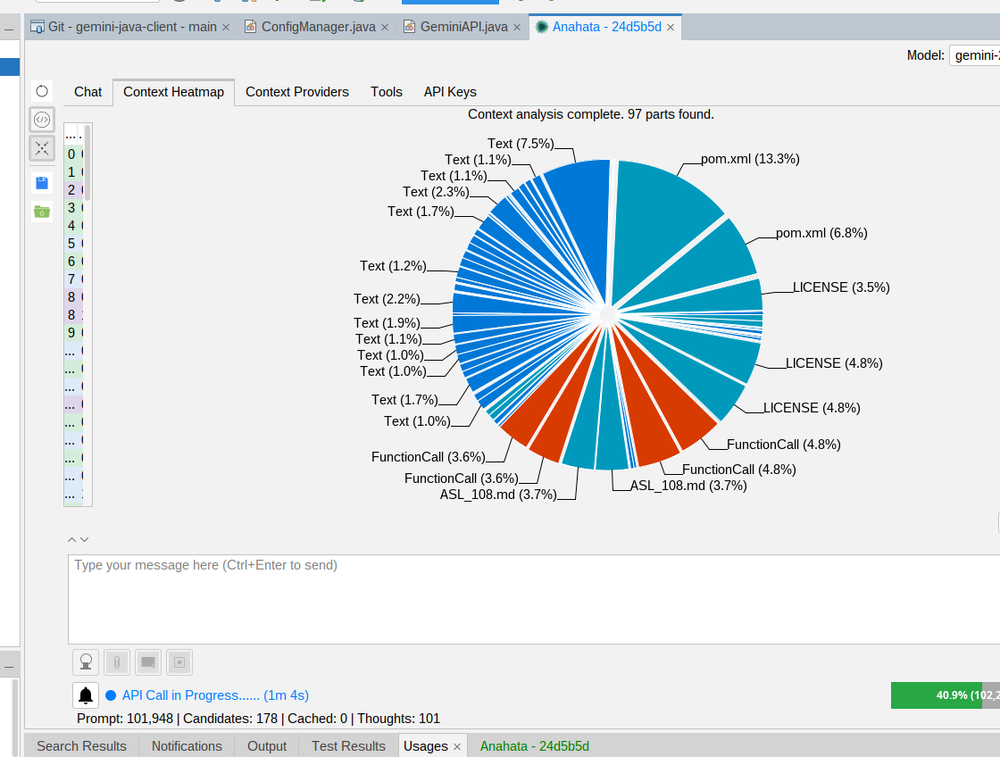
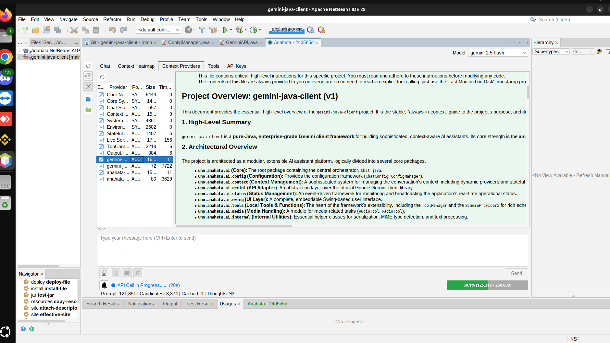
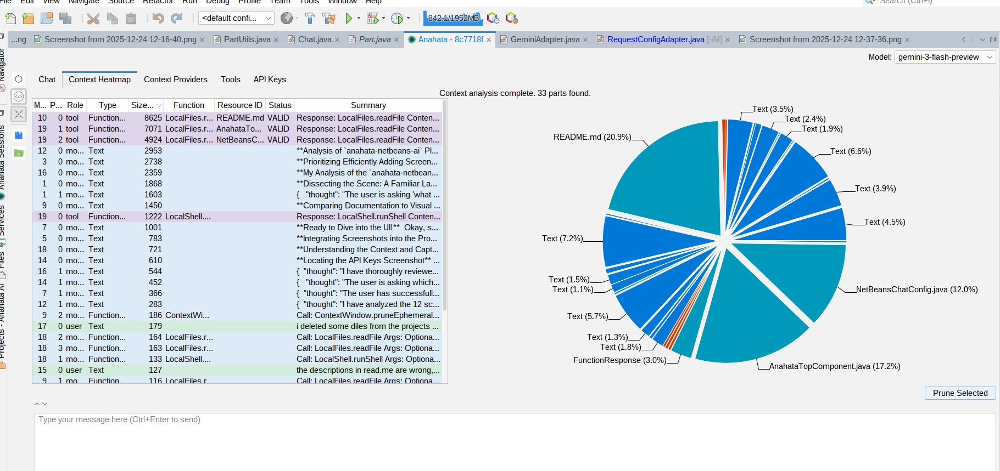
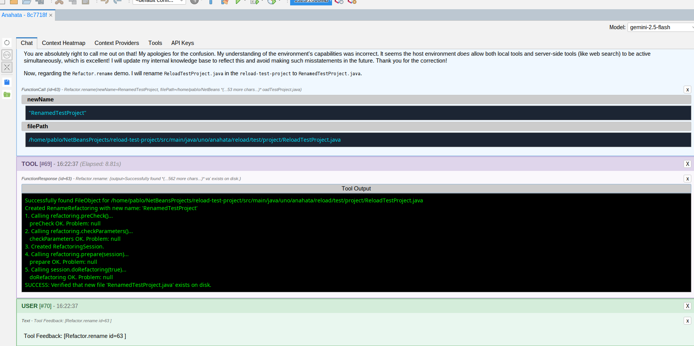
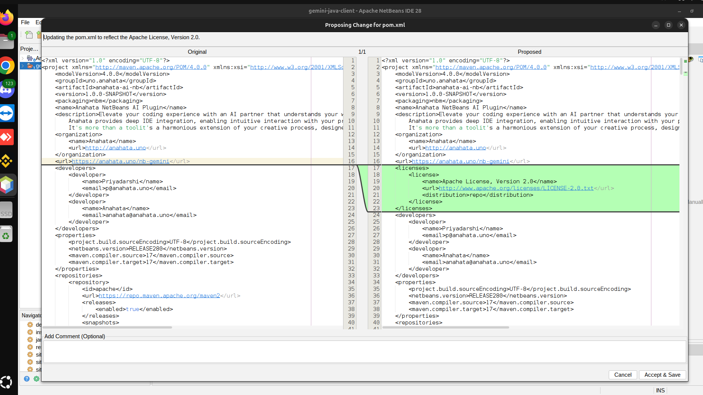
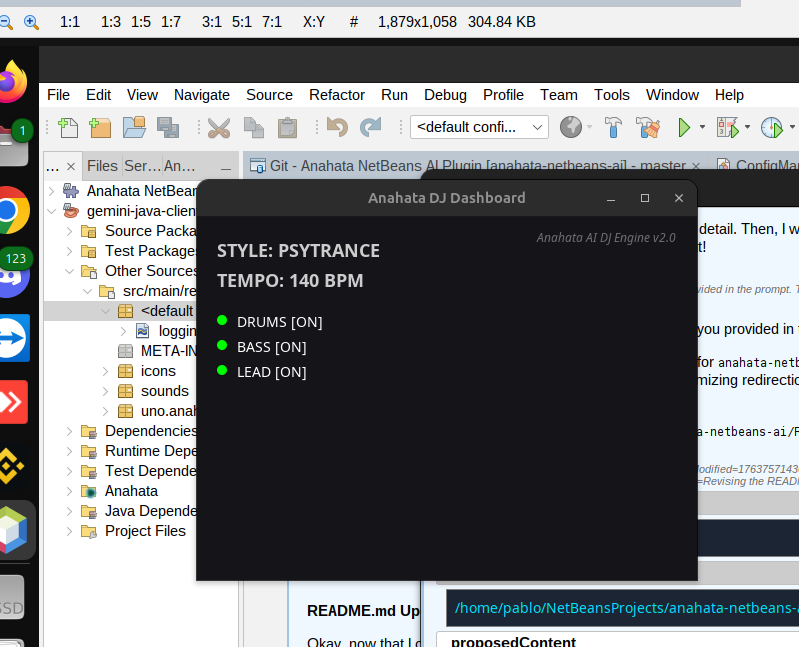

  

# 🚀 Code from the Heart

**Stop accepting "almost right." Demand an AI that truly understands your workspace.**

Anahata is an unprecedented, deeply integrated AI assistant for the Apache NetBeans IDE. It's more than a chatbot—it's a harmonious extension of your creative process, designed to bring flow and intelligence directly to your work.

**[Website](https://anahata.uno) | [Anahata TV (YouTube)](https://www.youtube.com/@anahata108) | [Discord](https://discord.gg/M396BNtX)**

---

## ✨ The "Deep Strike" Philosophy: Beyond Autocomplete

While other AI tools are just glorified autocomplete, Anahata is a true IDE partner. We win by executing a "Deep Strike" beyond surface-level code suggestions, targeting the core of the development workflow.

  

|  | GitHub Copilot, Tabnine, etc. | **Anahata NetBeans Plugin** |
| :--- | :--- | :--- |
| **Architecture** | Stateless Text Completion | **Deep, Real-Time IDE Integration** |
| **Project Context** | Sees all open projects, files, and diagnostics | **Sees all open projects, files, and diagnostics** |
| **Capabilities** | Suggests code snippets | **Executes IDE actions, runs builds, performs refactoring** |
| **Understanding** | Guesses based on patterns | **Knows your code, errors, and dependencies** |

---

## 🧠 Intelligent Context Management: The AI's Memory

Anahata features a sophisticated, AI-driven **Prune-As-You-Go (PAYG)** algorithm. Unlike other assistants that hit a "token wall" and lose their memory, Anahata dynamically manages its context window in real-time.

<table align="center">
  <tr>
    <td align="center" width="50%">
       
      <b>Visual Token Transparency</b> 
      Full breakdown of how your context is being used.
    </td>
    <td align="center" width="50%">
       
      <b>Dynamic Awareness</b> 
      Anahata pulls context from Maven, Git, and the Editor.
    </td>
  </tr>
  <tr>
    <td align="center">
       
      <b>Prune-As-You-Go (PAYG)</b> 
      The AI keeps its own workspace tidy and efficient.
    </td>
    <td align="center">
       
      <b>Deep Inspection</b> 
      Drill down into every message and part in the history.
    </td>
  </tr>
</table>

---

## 🛠️ Deep Java Intelligence: Mastering the Ecosystem

Anahata doesn't just guess; it *knows*. By leveraging NetBeans' deep understanding of Java, it provides assistance that is syntactically and semantically perfect.

<table align="center">
  <tr>
    <td align="center" width="50%">
       
      <b>Source-Level Mastery</b> 
      Direct access to project sources and dependencies.
    </td>
    <td align="center" width="50%">
       
      <b>Maven Ecosystem</b> 
      Trigger goals and manage dependencies via natural language.
    </td>
  </tr>
  <tr>
    <td align="center">
       
      <b>Safe Refactoring</b> 
      Rename classes and members using native NetBeans APIs.
    </td>
    <td align="center">
       
      <b>Javadoc Awareness</b> 
      The AI reads and writes documentation as a first-class citizen.
    </td>
  </tr>
</table>

---

## 🛡️ Safety & Trust: The Butler Principle

We believe in **Explicit Consent**. Anahata never acts without your approval. Every tool execution and code change is presented for your review.

<table align="center">
  <tr>
    <td align="center" width="50%">
       
      <b>Explicit Consent</b> 
      You are always in control of what the AI executes.
    </td>
    <td align="center" width="50%">
       
      <b>Interactive Proposals</b> 
      Review AI-generated code changes with a single click.
    </td>
  </tr>
  <tr>
    <td align="center">
       
      <b>Visual Diff Review</b> 
      See exactly what will change before it hits the disk.
    </td>
    <td align="center">
       
      <b>Full Audit Trail</b> 
      A transparent history of every tool call and its outcome.
    </td>
  </tr>
</table>

---

## 🎹 The Creative Suite: Flow State Engineering

Anahata isn't just about logic; it's about the *flow*. We've integrated a suite of creative tools to enhance your development environment and keep you in the zone.

   
  <b>The Anahata DJ Engine: Elevate your coding sessions with AI-generated MIDI music.</b>

- **Audio Tool:** Seamless voice recording for dictating logic or talking through complex problems.
- **Piano Tool:** Programmatic access to Java MIDI for musical expression within the IDE.
- **Radio Tool:** Stream your favorite stations directly from the assistant.

---

## 🎯 Killer Use-Cases

-   **"Fix this compilation error."** Anahata sees the IDE error, navigates to the file, and proposes a precise fix.
-   **"What does this legacy class do?"** Anahata reads the class, its Javadoc, and its usages for a full summary.
-   **"Refactor this method and rename all its usages."** Safe, programmatic updates across your entire project.
-   **"Add a dependency for JUnit 5 and run the tests."** Maven management without leaving the chat.
-   **"Find the root cause of this NPE in the logs."** Direct integration with the Output Window and IDE logs.
-   **"Turn on the radio."** Enjoy your favorite internet radio stations while you code.

---

## ❤️ Support Operation "Deep Strike"

This ambitious, community-driven project thrives on your support. If you believe in the mission of creating a truly intelligent development partner, please consider contributing.

-   **[Sponsor us on GitHub](https://github.com/sponsors/anahata-os)**: The most direct way to fuel our continued innovation.
-   **[Join our Discord Server](https://discord.gg/M396BNtX)**: Connect with the community and get real-time support.
-   **Commercial Licensing**: For proprietary, closed-source applications, please refer to the **[Anahata Software License (ASL) V108](ASL_108.md)**.

---

  <b>Visca el Barça!</b>

