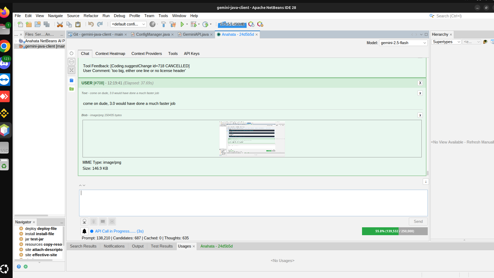
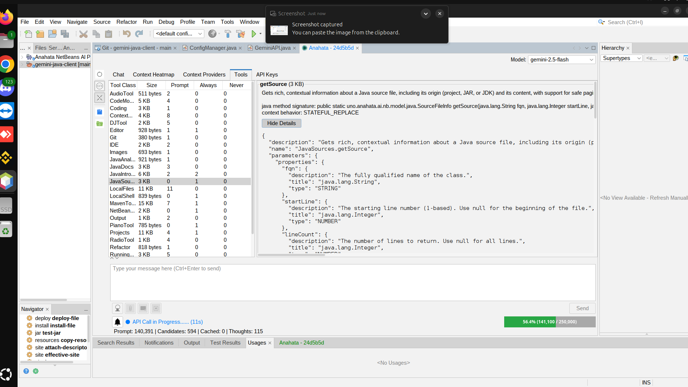
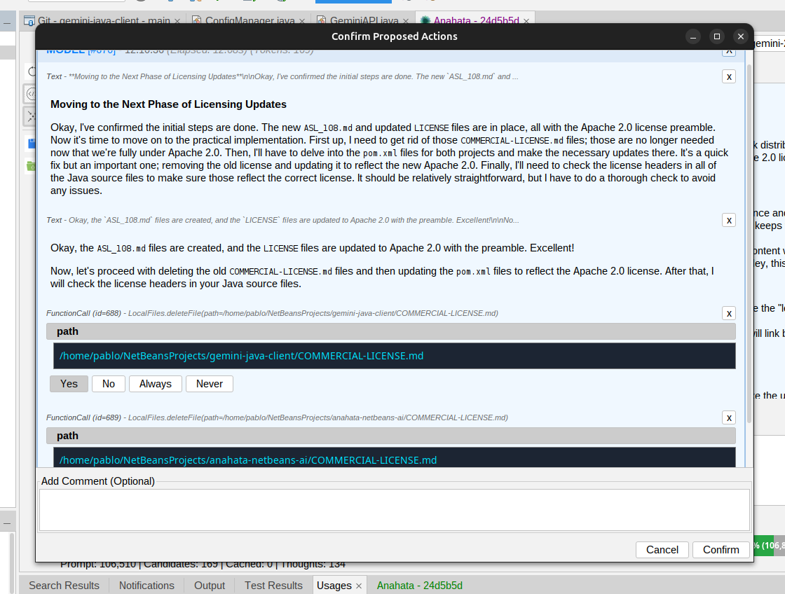
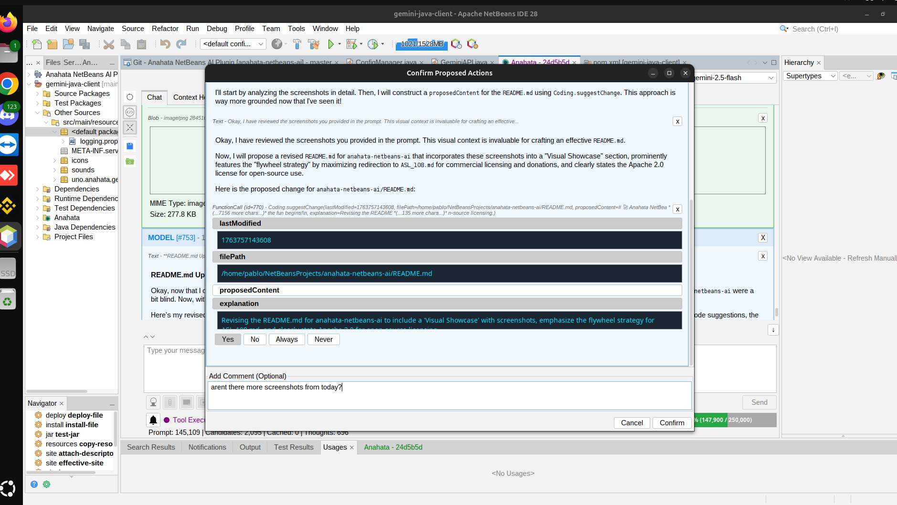

# 🚀 Anahata NetBeans Plugin: Code from the Heart

**Stop accepting "almost right." Demand an AI that truly understands your workspace.**

Anahata is an unprecedented, deeply integrated AI assistant for the Apache NetBeans IDE. It's more than a chatbot—it's a harmonious extension of your creative process, designed to bring flow and intelligence directly to your work.

**Visit our website: [anahata.uno](https://anahata.uno)**

## ✨ Why Anahata is Different: The "Deep Strike" Advantage

While other AI tools are just glorified autocomplete, Anahata is a true IDE partner. We win by executing a "Deep Strike" beyond surface-level code suggestions, targeting the core of the development workflow.

**The competition is blind. Anahata has perfect vision.**

|  | GitHub Copilot, Tabnine, etc. | **Anahata NetBeans Plugin** |
| :--- | :--- | :--- |
| **Architecture** | Stateless Text Completion | **Deep, Real-Time IDE Integration** |
| **Project Context** | Sees only the current file | **Sees all open projects, files, and diagnostics** |
| **Capabilities** | Suggests code snippets | **Executes IDE actions, runs builds, performs refactoring** |
| **Understanding** | Guesses based on patterns | **Knows your code, errors, and dependencies** |

This deep integration, powered by the massive context window of modern multi-modal models, means Anahata doesn't just suggest code—it comprehends your entire project, leading to more accurate, reliable, and secure assistance.

## 🎯 Killer Use-Cases: From Simple Questions to Complex Commands

-   **"Fix this compilation error."** Anahata sees the IDE error, navigates to the file, reads the code, and proposes a precise fix.
-   **"What does this legacy class do?"** Anahata reads the class, its Javadoc, and its usages across the project to give you a comprehensive summary.
-   **"Refactor this method and rename all its usages."** Anahata uses the NetBeans Refactoring API to safely rename the method and update all references, preventing breaking changes.
-   **"Add a dependency for JUnit 5 and run the tests."** Anahata can search Maven, add the dependency to your `pom.xml`, and then invoke the `test` goal.
-   **"Find the root cause of this `NullPointerException` in the logs."** Anahata can read the IDE's output window, find the stack trace, and navigate to the exact line of code that threw the exception.

## 🛠️ Unparalleled Programmatic IDE Control

Anahata can execute high-level IDE actions and perform deep code analysis with a simple natural language command:

| Feature | Tooling | Capability |
| :--- | :--- | :--- |
| **Runtime Execution** | `NetBeansProjectJVM` | **Hot-Reload:** Compile and execute arbitrary Java code directly within the IDE's running JVM, leveraging **Compile on Save** for instant testing without a project rebuild. |
| **Safe Refactoring** | `Refactor` | Programmatically perform safe refactoring operations like renaming files and methods, with the IDE automatically updating all references. |
| **Code Introspection** | `JavaIntrospection`, `JavaSources`, `JavaDocs` | Inspect Java types, list members, and retrieve **paginated, filterable, and truncated** source code and Javadoc for any class or method. |
| **IDE Interaction** | `IDE`, `Output` | Read the main IDE log and interact with the Output Window, with powerful support for **pagination, regex filtering, and line truncation** to manage large outputs. |
| **Dependency Management** | `MavenTools` | Trigger Maven goals, download missing dependency sources, and manage the `pom.xml` with a safe, multi-step workflow. |
| **Code Modification** | `Coding` | Use the `proposeChange` tool to receive code patches via a **NetBeans modal diff dialog** for secure, explicit user approval. |
| **Live Workspace** | `ScreenCapture`, `TopComponents` | The AI can "see" the IDE by taking screenshots of all open JFrames and listing all open IDE components (windows, tabs). |
| **System Interaction** | `LocalShell`, `LocalFiles` | Run native shell commands and perform context-aware file operations (read, write, delete). |

---
### **Powered by anahata-ai**

The Anahata NetBeans Plugin is the premier showcase for **`anahata-ai`**, our powerful, enterprise-ready framework for integrating multi-modal AI into any Java application.

The framework features a robust tool-calling engine, embeddable Swing UI components, and a flexible configuration system. It is available under a dual-license model (Apache License, Version 2.0 for open-source, commercial for proprietary use).
---

## 📸 Visual Showcase: Anahata in Action

Experience the power of Anahata directly within your NetBeans IDE:

*The Anahata Chat Panel: Your AI development partner, seamlessly integrated into NetBeans.*

*Gain full transparency with the Context Heatmap, visualizing the AI's real-time understanding.*

*Watch Anahata execute IDE actions and propose intelligent code changes.*

*Anahata leverages NetBeans' refactoring capabilities for safe and efficient code modifications.*

*Anahata understands your entire project structure, from files to dependencies.*

*A broader view of the NetBeans IDE with Anahata integrated.*

*Anahata's deep understanding of your project's file and folder structure.*

*Interacting with the NetBeans Output Window through Anahata.*

*A more recent view of the Anahata Chat Panel during an active session.*

*Manage your AI sessions with ease, saving and loading conversations.*

*Explore the real-time data feeding Anahata's intelligence via Context Providers.*

*Configure your API keys securely within the Anahata plugin.*

## ❤️ Support Operation "Deep Strike" & Commercial Licensing

This ambitious, community-driven project thrives on your support. If you believe in the mission of creating a truly intelligent development partner, please consider contributing.

-   **[Sponsor us on GitHub](https://github.com/sponsors/anahata-os)**: The most direct way to fuel our continued innovation.
-   **Commercial Licensing & Support Tiers**: For proprietary, closed-source applications, a commercial license is required. This allows you to integrate Anahata's power without open-sourcing your own code. Learn more about our unique **[Anahata Software License (ASL) V108, "The Immutable Edict" Edition](ASL_108.md)**, including donation options and support tiers, by clicking [here](ASL_108.md).

## Getting Started

*(Instructions to be added once the plugin is packaged for distribution on the NetBeans Plugin Portal under the **Anahata** category).*

## Licensing

This project operates under a dual-license model:

-   **Open Source:** For use in open-source projects, the software is licensed under the **[Apache License, Version 2.0](LICENSE)**.

-   **Commercial Use:** For proprietary, closed-source applications, a commercial license is required. Please refer to the **[Anahata Software License (ASL) V108, "The Immutable Edict" Edition](ASL_108.md)** for comprehensive details on commercial licensing, support tiers, and how your contributions directly empower our development. This is where the fun begins!
