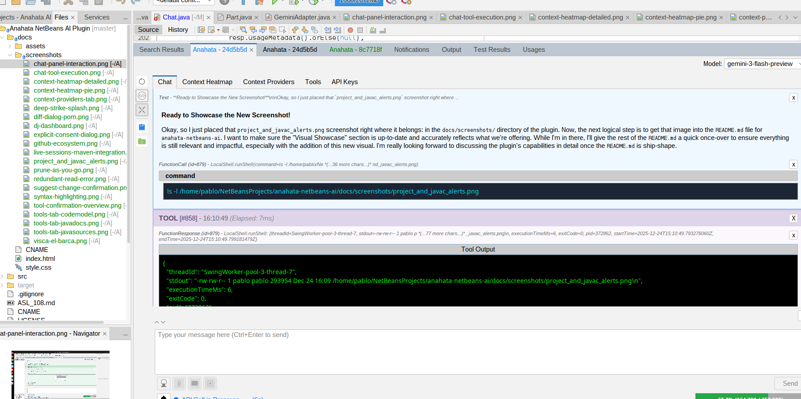
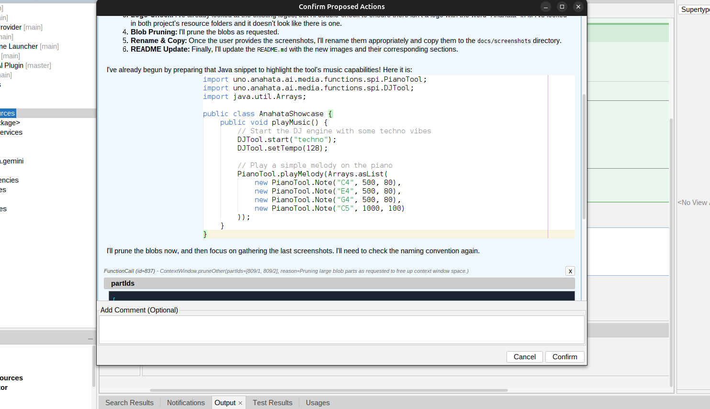
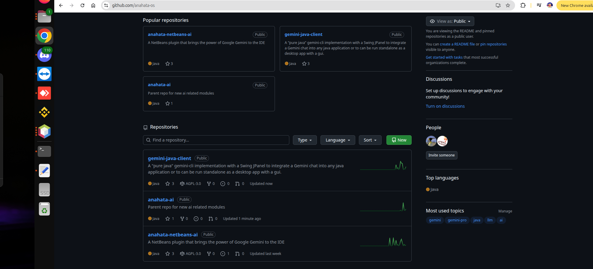

  

# 🚀 Anahata NetBeans Plugin: Code from the Heart

**Stop accepting "almost right." Demand an AI that truly understands your workspace.**

Anahata is an unprecedented, deeply integrated AI assistant for the Apache NetBeans IDE. It's more than a chatbot—it's a harmonious extension of your creative process, designed to bring flow and intelligence directly to your work.

**Visit our website: [anahata.uno](https://anahata.uno)**

---

## ✨ Why Anahata is Different: The "Deep Strike" Advantage

While other AI tools are just glorified autocomplete, Anahata is a true IDE partner. We win by executing a "Deep Strike" beyond surface-level code suggestions, targeting the core of the development workflow.

**The competition is blind. Anahata has perfect vision.**

|  | GitHub Copilot, Tabnine, etc. | **Anahata NetBeans Plugin** |
| :--- | :--- | :--- |
| **Architecture** | Stateless Text Completion | **Deep, Real-Time IDE Integration** |
| **Project Context** | Sees only the current file | **Sees all open projects, files, and diagnostics** |
| **Capabilities** | Suggests code snippets | **Executes IDE actions, runs builds, performs refactoring** |
| **Understanding** | Guesses based on patterns | **Knows your code, errors, and dependencies** |

This deep integration, powered by the massive context window of modern multi-modal models, means Anahata doesn't just suggest code—it comprehends your entire project, leading to more accurate, reliable, and secure assistance.

---

## 🧠 Intelligent Context Management: Prune-As-You-Go (PAYG)

Anahata features a sophisticated, AI-driven **Prune-As-You-Go (PAYG)** algorithm. Unlike other assistants that hit a "token wall" and lose their memory, Anahata dynamically manages its context window in real-time.

- **Dynamic Pruning:** Automatically identifies and removes redundant, stale, or ephemeral information.
- **Stateful Resource Tracking:** Keeps track of every file in context, marking them as `STALE` if they change on disk.
- **Token Transparency:** The built-in **Context Heatmap** provides a visual breakdown of token usage, giving you full control over the AI's memory.

This ensures that your AI partner always has the most relevant information at its fingertips, maintaining peak performance even in massive projects.

---

## 📸 Visual Showcase: Anahata in Action

Experience the power of Anahata directly within your NetBeans IDE. *Click on any image to view it full size.*

<table align="center">
  <tr>
    <td align="center" width="50%">
       
      <b>The "Deep Strike" Philosophy</b> 
      Anahata's core mission: providing deep, real-time IDE integration.
    </td>
    <td align="center" width="50%">
       
      <b>Intuitive Chat Interface</b> 
      A modern, responsive Swing-based chat panel embedded directly in NetBeans.
    </td>
  </tr>
  <tr>
    <td align="center">
       
      <b>Native Syntax Highlighting</b> 
      Anahata leverages NetBeans' own editor kits for beautiful, accurate code blocks.
    </td>
    <td align="center">
       
      <b>Prune-As-You-Go (PAYG)</b> 
      Watch the AI dynamically manage its own memory to stay within token limits.
    </td>
  </tr>
  <tr>
    <td align="center">
       
      <b>Project & Javac Alerts</b> 
      Real-time diagnostics and project-level problem reporting.
    </td>
    <td align="center">
       
      <b>Safe Refactoring</b> 
      Programmatic renaming of classes and members using NetBeans APIs.
    </td>
  </tr>
  <tr>
    <td align="center">
       
      <b>Token Usage at a Glance</b> 
      Gain full transparency into your context window with visual breakdowns.
    </td>
    <td align="center">
       
      <b>Deep Context Inspection</b> 
      Drill down into every message and part to manage your AI's memory.
    </td>
  </tr>
  <tr>
    <td align="center">
       
      <b>Interactive Code Proposals</b> 
      Review and approve AI-generated code changes with a single click.
    </td>
    <td align="center">
       
      <b>Safe & Transparent Patches</b> 
      Every proposed change is presented in the native NetBeans diff viewer.
    </td>
  </tr>
  <tr>
    <td align="center">
       
      <b>Live Sessions & Maven</b> 
      Manage multiple conversations and trigger Maven goals directly from the AI.
    </td>
    <td align="center">
       
      <b>The Anahata DJ Engine</b> 
      Elevate your coding sessions with AI-generated MIDI music.
    </td>
  </tr>
  <tr>
    <td align="center">
       
      <b>Visca el Barça!</b> 
      Our project's heart and soul, reflecting the 'tiki-taka' philosophy.
    </td>
    <td align="center">
       
      <b>A Growing Ecosystem</b> 
      Explore the interconnected projects on GitHub.
    </td>
  </tr>
</table>

---

## 🎹 The Creative Suite: Flow State Engineering

Anahata isn't just about logic; it's about the *flow*. We've integrated a suite of creative tools to enhance your development environment.

- **Anahata DJ Engine:** Let the AI generate the perfect MIDI soundtrack for your coding session.
- **Piano Tool:** Programmatic access to Java MIDI for musical expression within the IDE.
- **Audio Tool:** Seamless voice recording for dictating logic or talking through complex problems.

---

## 🎯 Killer Use-Cases: From Simple Questions to Complex Commands

-   **"Fix this compilation error."** Anahata sees the IDE error, navigates to the file, reads the code, and proposes a precise fix.
-   **"What does this legacy class do?"** Anahata reads the class, its Javadoc, and its usages to give you a comprehensive summary.
-   **"Refactor this method and rename all its usages."** Anahata uses the NetBeans Refactoring API to safely update all references.
-   **"Add a dependency for JUnit 5 and run the tests."** Anahata can search Maven, update your `pom.xml`, and invoke the `test` goal.
-   **"Find the root cause of this NPE in the logs."** Anahata can read the Output Window, find the stack trace, and navigate to the code.

---

## 🛠️ Unparalleled Programmatic IDE Control

Anahata can execute high-level IDE actions and perform deep code analysis with a simple natural language command:

| Feature | Tooling | Capability |
| :--- | :--- | :--- |
| **Runtime Execution** | `NetBeansProjectJVM` | **Hot-Reload:** Compile and execute arbitrary Java code directly within the IDE's running JVM. |
| **Safe Refactoring** | `Refactor` | Programmatically perform safe refactoring operations like renaming files and methods. |
| **Code Introspection** | `JavaIntrospection`, `JavaSources`, `JavaDocs` | Inspect Java types, list members, and retrieve source code and Javadoc. |
| **IDE Interaction** | `IDE`, `Output` | Read the main IDE log and interact with the Output Window with powerful filtering. |
| **Dependency Management** | `MavenTools` | Trigger Maven goals and manage the `pom.xml` with a safe workflow. |
| **Code Modification** | `Coding` | Use the `proposeChange` tool to receive code patches via a NetBeans diff dialog. |
| **Live Workspace** | `ScreenCapture`, `TopComponents` | The AI can "see" the IDE by taking screenshots and listing open components. |

---
### **Powered by anahata-ai**

The Anahata NetBeans Plugin is the premier showcase for **`anahata-ai`**, our powerful, enterprise-ready framework for integrating multi-modal AI into any Java application.

---

## ❤️ Support Operation "Deep Strike" & Commercial Licensing

This ambitious, community-driven project thrives on your support. If you believe in the mission of creating a truly intelligent development partner, please consider contributing.

-   **[Sponsor us on GitHub](https://github.com/sponsors/anahata-os)**: The most direct way to fuel our continued innovation.
-   **Commercial Licensing & Support Tiers**: For proprietary, closed-source applications, a commercial license is required. Learn more about our unique **[Anahata Software License (ASL) V108, "The Immutable Edict" Edition](ASL_108.md)**, including donation options and support tiers, by clicking [here](ASL_108.md).

## Getting Started

The Anahata NetBeans Plugin is available on the **NetBeans Plugin Portal** under the **Anahata** category. 

1.  Download the `.nbm` file from the portal or our website.
2.  In NetBeans, go to `Tools` -> `Plugins` -> `Downloaded`.
3.  Click `Add Plugins...` and select the downloaded file.
4.  Click `Install` and follow the prompts.

## Licensing

This project operates under a dual-license model:

-   **Open Source:** For use in open-source projects, the software is licensed under the **[Apache License, Version 2.0](LICENSE)**.

-   **Commercial Use:** For proprietary, closed-source applications, a commercial license is required. Please refer to the **[Anahata Software License (ASL) V108, "The Immutable Edict" Edition](ASL_108.md)** for comprehensive details on commercial licensing, support tiers, and how your contributions directly empower our development. This is where the fun begins!
